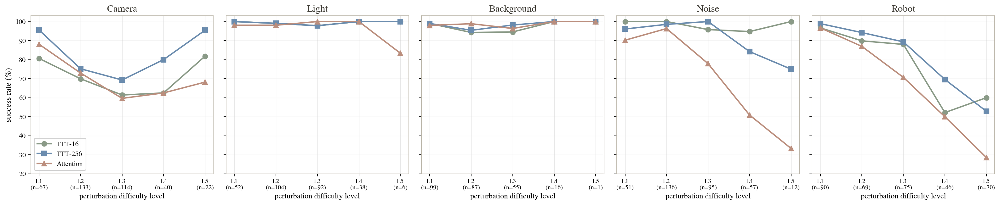

# WAM-TTT: Token-Mixer Ablations for VLA World Models

A research fork of **[VLANeXt](https://github.com/DravenALG/VLANeXt)** (ICML 2026) that ablates the
**token mixer** in the vision world-model DiT — softmax attention, **TTT** (test-time-training
fast-weight), **GatedDeltaNet (GDN)**, and **sliding-window attention (SWA)** — and quantifies their
**robustness under environment perturbations** on LIBERO / LIBERO-plus.

This repository is the **code and tooling backup** of the work; checkpoints, rendered videos, and
benchmark assets (~400 GB) are excluded via `.gitignore`. All material required to reproduce the
experiments is present.

## Contributions

| Component | Description | Location |
|---|---|---|
| Mixer ablation | TTT / GDN / SWA / SWA+GDN / SWA+TTT in the generator DiT | `src/models/{ttt,linear_attn_mixer,generator}.py` |
| Block-causal TTT | `chunk_size` sets TTT block granularity (16 blocks → 1 block/frame) | `generator_ttt_chunk_size` |
| CUDA TTT operator | Fused causal forward/backward + O(n) incremental decode; bf16-equivalent to torch | `src/models/ttt_cuda/` |
| Job scheduler | Fault-tolerant GPU/RAM orchestrator for all trainings and evals | `scripts/scheduler.py` |
| Env-gen eval | Sharded LIBERO-plus generalization eval (1627 tasks, 5 dimensions) | `scripts/libero_plus_bench_eval.py` |
| Severity analysis | Re-aggregation by `difficulty_level` 1–5 → robustness curves | `scripts/{aggregate_envgen,plot_severity_curves}.py` |

**Principal finding.** TTT's online adaptation yields a robustness advantage that *widens with
perturbation strength*: at the highest sensor-noise level TTT retains ≈100% success while softmax
attention falls to ≈33% (see [Results](#results)).

## Setup

```bash
conda create -n VLANeXt python=3.10 && conda activate VLANeXt
pip install torch==2.4.0 torchvision==0.19.0 torchaudio==2.4.0 --index-url https://download.pytorch.org/whl/cu124
pip install -r requirements.txt && pip install flash-attn --no-build-isolation
```

Benchmarks are not vendored — clone into `third_party/`:

```bash
cd third_party
git clone https://github.com/Lifelong-Robot-Learning/LIBERO.git      && pip install -e LIBERO
git clone https://github.com/sylvestf/LIBERO-plus.git                && pip install -e LIBERO-plus  # pin 4976dc3
```

Download the OpenVLA-modified LIBERO episodes and the LIBERO-plus assets per their READMEs, then set
`data.data_root` and `model.pretrained_checkpoint` in each config.

> **PYTHONPATH.** Training requires `PYTHONPATH=$REPO`. LIBERO-plus eval requires
> `PYTHONPATH=$REPO/third_party/LIBERO-plus:$REPO`, a `cd` into `third_party/LIBERO-plus`, and
> `MUJOCO_GL=osmesa` — otherwise `ModuleNotFoundError: libero`. The launch scripts set these.

## Usage

```bash
# Train (batch_size is the total across GPUs; keep save_interval: 10000)
PYTHONPATH=$PWD torchrun --nproc_per_node=4 scripts/train.py --config config/ablation_wm_ttt_chunk256.yaml

# Env-gen eval, 8-way sharded (run from third_party/LIBERO-plus)
python scripts/libero_plus_bench_eval.py --config config/libero_plus_envgen_ttt256_shard${s}.yaml

# Aggregate and plot
python scripts/aggregate_envgen.py            # per-dimension table
python scripts/plot_severity_curves.py        # robustness vs. difficulty → docs/severity_curves.png
```

For multi-job runs, prefer the scheduler over launching by hand (see below).

## Scheduler

`scripts/scheduler.py` is the single entry point for running every training and evaluation on the box.
It packs jobs across the GPUs concurrently under a combined **GPU-free + cgroup-RAM** gate, leases
GPUs so jobs never collide, detects crashes and retries them, and persists state so a restart resumes.
Routing all work through it avoids the out-of-memory, port-collision, and silently-skipped-run failures
that ad-hoc launches cause.

**Define the work.** Edit the `QUEUE` list — a priority-ordered list of two job kinds:

```python
QUEUE = [
    # eval: N single-GPU shard workers; done when every shard writes an *_SR* result dir
    {"kind": "eval",  "tag": "ttt64_envgen", "prefix": "ttt64", "nshards": 8,
     "result_dir": "ttt_chunk64_libero_spatial", "shard_glob": "envgen_ttt64_shard"},
    # train: N-GPU torchrun DDP; done when checkpoint_final.pt exists; gpus defaults to 2
    {"kind": "train", "tag": "swa_ttt", "cfg": "ablation_wm_swa_ttt",
     "save_dir": "swa_ttt_libero_spatial", "gpus": 4},
]
```

A `train` job needs a `config/<cfg>.yaml` (with `distributed: true` and `save_interval: 10000`); an
`eval` job needs its `config/libero_plus_envgen_<prefix>_shard{0..N-1}.yaml` shards. Eval workers
co-reside on cards (~1 GPU + 22 GB RAM each, up to `EVAL_MAX_WORKERS`) and scale elastically as RAM
frees; training jobs lease whole cards. Higher-priority jobs claim resources first, and spare capacity
is filled by lower-priority jobs automatically.

**Run it** under `tmux` (long-lived, reattachable):

```bash
tmux new-session -d -s vlanext-sched -c $PWD
tmux send-keys -t vlanext-sched "python scripts/scheduler.py 2>&1 | tee logs/scheduler.log" Enter

python scripts/scheduler.py --status     # queue + per-job status (done / running / queued / failed)
touch .scheduler_stop                     # graceful stop (running jobs keep going)
```

Tunables (GPU/RAM thresholds, poll cadence, retry count) are constants at the top of the file. The
launched trainings and eval workers are independent process groups, so they survive a scheduler
restart; only the watcher lives in `tmux`.

## Configuration

Configs are named `ablation_wm_<mixer>[_<chunk>][_<suite>].yaml`. The mixer is selected by:

```yaml
model:
  generator_mixer_type: "ttt"        # attention | ttt | gdn | swa
  generator_mix_every_n: 4           # every 4th DiT layer is a mixer layer (7 of 29)
  generator_ttt_chunk_size: 256      # 16 → 16 blocks/frame; 256 → 1 block/frame
  generator_fallback_mixer: "swa"    # SWA+X variants
  generator_swa_window_size: 64
train:
  distributed: true                  # required for multi-GPU; false collapses all ranks onto GPU0
data:
  max_steps: 30000                   # ×1.2 for the long suite; read from data.max_steps
```

> **GDN stability.** GatedDeltaNet diverges at lr 1e-4. Use lr 5e-5, warmup 3000, grad_clip 0.5.

See [DESIGN_SPACE.md](DESIGN_SPACE.md), [TTT_ARCHITECTURE.md](TTT_ARCHITECTURE.md), and
[COMMON_ISSUES.md](COMMON_ISSUES.md) for details.

## CUDA TTT operator (training + O(n) inference)

The TTT mixer ships a custom CUDA/C++ operator (`src/models/ttt_cuda/`) that fuses the
kernel-launch storm of the eager-torch path and adds an **incremental O(n) decode** for the
generator's autoregressive image rollout. It is **numerically equivalent to the torch reference
within bf16 round-off** — verified on the real TTT-256 checkpoint (`scripts/equiv_predict_action_b.py`:
incremental-vs-bf16 error ≤ the bf16-vs-fp32 floor on the hidden states that feed the action head).

### Build

No pre-build step. The extension is **JIT-compiled on first import** via
`torch.utils.cpp_extension.load`, keyed to the actual device capability (A800 = `sm_80`; do not assume
`sm_90` from the `afs-h200` path). Requires a CUDA toolchain (`nvcc`) matching the torch CUDA version.

```bash
# Trigger the build once (compiles to ~/.cache/torch_extensions/.../ttt_fused_cuda);
# HAVE_CUDA_TTT becomes True. Subsequent imports are instant.
TORCHDYNAMO_DISABLE=1 PYTHONPATH=$PWD python -c \
  "from src.models.ttt_cuda import _load_extension; print('built:', _load_extension() is not None)"

TTT_CUDA_VERBOSE=1 ...        # echo the nvcc compile lines
TORCH_CUDA_ARCH_LIST=8.0 ...  # override the target arch (else auto-detected)
```

If the toolchain or CUDA is unavailable the build fails **soft**: `HAVE_CUDA_TTT=False`, a warning is
emitted, and every call routes to the pure-torch op — results are unchanged, only slower. A killed
build can leave a stale `lock` in the extension cache dir; delete it before re-importing.

### Switching the operator

Two independent switches, both **default off → byte-identical to the original torch path** (zero eval
regression). Set them in a config's `model:` block:

```yaml
model:
  generator_mixer_type: "ttt"
  generator_ttt_use_cuda_kernel: true     # fused CUDA causal forward + backward (train & infer)
  generator_use_incremental_gen: true     # O(n) incremental image-token decode in predict_action
```

- `generator_ttt_use_cuda_kernel` swaps `causal_block_fast_weight_swish_glu` for the CUDA op
  (`causal_ttt`, forward + exact backward); falls back to torch when `muon_update_steps > 0` or the
  build is unavailable.
- `generator_use_incremental_gen` makes `predict_action` decode the 256 image tokens with
  `ImageGeneratorTransformer.generate_incremental` (TTT layers reuse the VLM-pre-updated fast weights
  per `infer_step`; attention layers use a KV-cache) instead of re-running the full generator on the
  growing prefix at every step. Both switches compose.

In code the same toggles are `generator_ttt_use_cuda_kernel=...` on the `VLANeXt`/`ImageGeneratorTransformer`
constructor and `model.use_incremental_gen = True` on an instance.

### Verify / benchmark

```bash
# correctness: incremental == full-recompute on the real checkpoint (run on a CLEAN GPU)
TORCHDYNAMO_DISABLE=1 PYTHONPATH=$PWD CUDA_VISIBLE_DEVICES=<clean> \
  python -m scripts.equiv_predict_action_b
# latency: O(n^2) full-recompute vs O(n) incremental (torch & CUDA)
TORCHDYNAMO_DISABLE=1 PYTHONPATH=$PWD CUDA_VISIBLE_DEVICES=<clean> \
  python -m scripts.bench_ttt_incremental_infer
```

## Key Results

LIBERO-spatial trained; evaluated on LIBERO-plus env-gen (1627 tasks, 5 dimensions, all configs aligned).

| Dimension | TTT-16 | TTT-256 | Attention |
|---|---|---|---|
| Camera | 69.1 | **78.7** | 70.2 |
| Light | 99.0 | 99.0 | 98.6 |
| Background | 96.5 | 97.7 | 98.1 |
| Noise | 98.0 | 95.4 | 80.9 |
| Robot | 80.3 | **82.9** | 69.4 |
| **Total** | 87.5 | **89.9** | 81.9 |

Resolving success rate by perturbation strength (`difficulty_level` 1–5) exposes the central result:
configurations tie at low perturbation, but TTT degrades far more gracefully as strength increases,
whereas softmax attention collapses — most sharply on sensor noise and robot initial states.



## Citation

The base codebase, models, and benchmark are VLANeXt (ICML 2026):

```bibtex
@article{wu2026vlanext,
    title={VLANeXt: Recipes for Building Strong VLA Models},
    author={Xiao-Ming Wu and Bin Fan and Kang Liao and Jian-Jian Jiang and Runze Yang and Yihang Luo and Zhonghua Wu and Wei-Shi Zheng and Chen Change Loy},
    journal={arXiv preprint arXiv:2602.18532},
    year={2026},
}
```

Upstream: [VLANeXt](https://github.com/DravenALG/VLANeXt) ·
[LIBERO](https://github.com/Lifelong-Robot-Learning/LIBERO) ·
[LIBERO-plus](https://github.com/sylvestf/LIBERO-plus). Please observe their licenses (base project:
NTU S-Lab License 1.0, see [LICENSE](LICENSE)).
