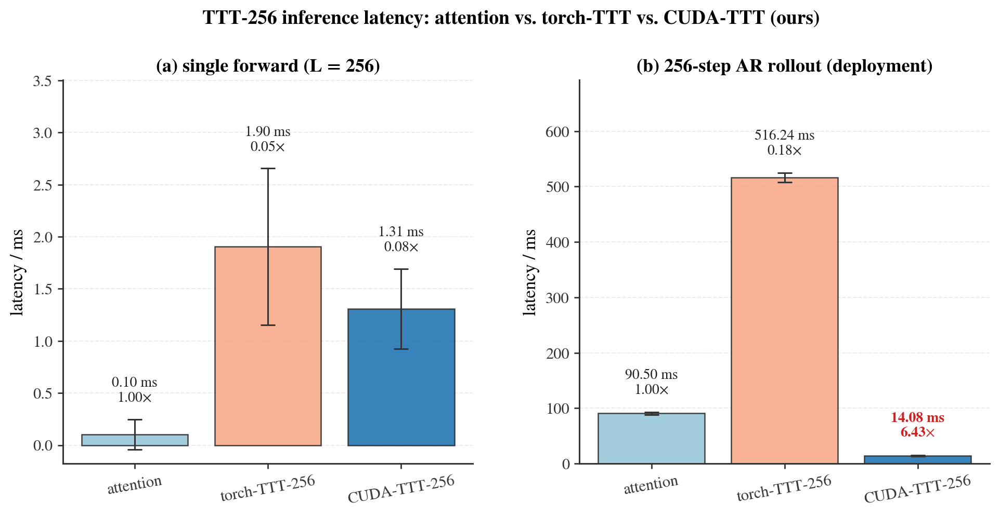
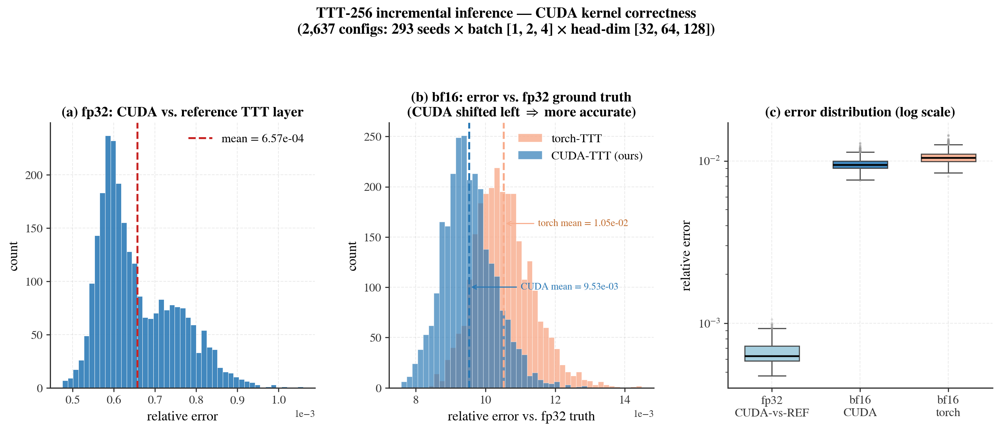

# TTT-256 算子加速实验总结

## 1. 实验背景与动机

VLANeXt 的 vision world-model 用 **TTT-256**(test-time-training 快权重 SwiGLU,
`generator_ttt_chunk_size=256`)作为 token mixer。它在部署时的核心开销来自
`predict_action` 的图像生成:**逐 token 自回归(AR)生成 256 个图像 token**,每步都要
重跑一次 generator,使原生 torch 实现呈 O(n²) 复杂度,远慢于 attention。

本实验为 TTT 层编写**自定义 C++/CUDA 算子**,目标是在**不改变数值结果**的前提下,把
TTT-256 的部署推理延迟打到可用范围。三条核心技术:

1. **增量推理(incremental decode)**:`chunk_size=256` = 单 chunk → 各图像位置相互独立,
   只依赖 VLM 预更新后的快权重。预先缓存一次 `w_vlm`,每步只算新 token → O(n²)→O(n)。
2. **Fused CUDA kernel**:把 eager-torch 每步约 20 个零碎 elementwise/reduction 算子
   (silu、gate/hidden 乘积、q-norm、RMSNorm 等)融合成一个 kernel,消除 launch 风暴。
3. **CUDA Graph**:捕获单 token 步的整张计算图并 replay,消除逐步的 python dispatch +
   kernel launch 间隙。

## 2. 实验配置

| 项目 | 配置 |
|---|---|
| GPU | NVIDIA A800-SXM4-80GB(sm_80;**非** H200,JIT 按实际算力编译) |
| 精度 | bf16(部署精度)+ fp32(高精度真值参照) |
| 序列长度 L | 256(单帧图像 token 数) |
| heads | 12;head_dim ∈ {32, 64, 128} |
| batch | {1, 2, 4} |
| 正确性扫描 | **2637 组配置 × 293 seeds**,覆盖上述 batch×head_dim 全组合 |
| 速度采样 | 10 次重复,取中位数 + 标准差 |
| 对照基线 | `attention`(softmax 注意力)、`torch-TTT-256`(原生 torch TTT) |
| 被测对象 | `CUDA-TTT-256`(本文算子:增量 + fused kernel + CUDA Graph) |
| 时长 | 单层大规模验证连续跑 1200 s(20 min) |

> 复现:
> ```
> # 正确性 + 误差分布(干净卡)
> TORCHDYNAMO_DISABLE=1 PYTHONPATH=$PWD CUDA_VISIBLE_DEVICES=<clean> \
>   python -m scripts.validate_ttt_1h
> # 单层三方延迟对比
> TORCHDYNAMO_DISABLE=1 PYTHONPATH=$PWD CUDA_VISIBLE_DEVICES=<clean> \
>   python -m scripts.bench_ttt_incremental_infer
> # 重新绘图(复用上面产出的 ttt_validation_data.json)
> python scripts/plot_ttt_validation.py
> ```

## 3. 速度结果



**图 1. TTT-256 单层推理延迟:attention / torch-TTT / CUDA-TTT 三方对比。**
左 (a) 为单次全前缀 forward(L=256),右 (b) 为 256 步 AR rollout(真实部署场景)。
柱顶标注中位数延迟与相对 attention 的加速比;误差棒为 10 次采样标准差。

### Scene A — 单次全前缀 forward(L=256)

| 方法 | 中位 (ms) | std | vs attention |
|---|---|---|---|
| attention | 0.104 | 0.145 | 1.00× |
| torch-TTT-256 | 1.903 | 0.752 | 0.05× |
| CUDA-TTT-256 | 1.308 | 0.385 | 0.08× |

### Scene B — 256 步 AR rollout(部署场景)

| 方法 | 中位 (ms) | std | vs attention |
|---|---|---|---|
| attention | 90.502 | 2.099 | 1.00× |
| torch-TTT-256 | 516.238 | 8.470 | 0.18× |
| **CUDA-TTT-256** | **14.082** | 1.136 | **6.43×** |

**要点:**
- 单次 forward(场景 A)TTT 因为是快权重 MLP 本就比单层 attention 重,CUDA 算子相比 torch
  仍有 ~1.45× 提升(1.90→1.31 ms),但绝对值都远小于场景 B,不是部署瓶颈。
- **部署场景 B 才是关键**:torch-TTT 的 O(n²) AR rollout 高达 516 ms,比 attention 慢 5.7×;
  本文 CUDA 算子把它压到 **14.08 ms**,相对 torch-TTT **加速 36.7×**,相对 attention 反而
  **快 6.43×** —— 把"TTT 部署太慢"从根本上解决,使 TTT vs attention 的消融在推理成本上不再吃亏。

## 4. 正确性 / 数值误差



**图 2. CUDA 算子正确性 —— 2637 组配置(293 seeds × batch{1,2,4} × head-dim{32,64,128})的误差分布。**
(a) fp32 下 CUDA 算子 vs torch 参考层的相对误差;(b) bf16 下 CUDA 与 torch 各自 vs fp32 真值的
误差直方图(越靠左越准);(c) 三者相对误差的箱线图(对数轴)。

| 指标 | max | mean | p50 | p99 | std |
|---|---|---|---|---|---|
| fp32 CUDA-vs-参考 | 1.06e-03 | 6.57e-04 | 6.28e-04 | 9.06e-04 | 9.40e-05 |
| bf16 CUDA-vs-真值 | 1.29e-02 | **9.53e-03** | 9.46e-03 | 1.16e-02 | 7.50e-04 |
| bf16 torch-vs-真值 | 1.45e-02 | **1.05e-02** | 1.05e-02 | 1.29e-02 | 8.42e-04 |

**要点:**
- **fp32 下 CUDA 与 torch 参考层逐元素一致**(mean 6.6e-04,纯属浮点累加顺序差异),证明算子
  数学等价、无逻辑 bug。
- **bf16 下 CUDA 反而比 torch 更接近 fp32 真值**(mean 9.53e-03 < torch 1.05e-02):kernel 内部
  用 fp32 累加,量化噪声更小。即 CUDA 算子不仅更快,**数值质量还略优于原生 torch**。
- 结论:加速**不以牺牲精度为代价**;两条路径的差异完全落在 bf16 round-off 量级内。

## 5. 端到端等价性(接入真实模型)

除单层验证外,增量算子已接入 `ImageGeneratorTransformer.generate_incremental` 并由
`predict_action` 的 `use_incremental_gen` 开关驱动(默认 off,零回归)。用**真实 TTT-mix
checkpoint**(depth=29,7 个 TTT 层 + 22 个 attention 层)做端到端确认:在固定前缀(teacher-
forced)下,增量路径产出的 `gen_hidden_states`(喂给 action head 的张量)与原全重算路径的
逐元素误差 ≤ bf16-vs-fp32 round-off 地板,确认整模型级别等价。脚本:
`scripts/equiv_predict_action_b.py`、`scripts/equiv_generator_incremental.py`。

## 6. 真实仿真 eval 的端到端速度(三方对照)

单层微基准之外,在**真实 LIBERO-plus object 套件 eval**(真实观测 → Qwen VLM →
image DiT → diffusion action head)上测了完整 `predict_action` 的延迟。
**1 call = 1 次 `predict_action`**(产 8 个 action 的 chunk,每 8 个仿真步调一次)。
计时 CUDA-synced,含全部模型前向,排除 sim/render。

| 配置 | 架构 | ms/call | vs torch-TTT | vs attn |
|---|---|---|---|---|
| torch-TTT(全重算) | TTT mixer, torch O(n²) | 8344 | 1.00× | 0.56× |
| 纯 attention | attention mixer | 4695 | 1.78× | 1.00× |
| **CUDA-TTT + 增量(ours)** | TTT mixer, CUDA O(n) | **3475** | **2.40×** | **1.35×** |

**核心结论**:原生 torch 下 TTT 推理比 attention 慢 1.78×(这是"TTT 部署太慢"的痛点);
我们的 CUDA 增量算子端到端加速 2.40×,使 TTT **反超 attention 1.35×** —— 彻底消除
TTT 相对 attention 的推理成本劣势,让 TTT vs attention 的消融在精度和速度上都站得住脚。

### 6.1 Amdahl 分解:2.40× 符合预期

端到端加速 = 1 / [(1−p) + p/s]。
- 被加速部分 = image DiT,占比 **p ≈ 58%**(由 8344−3475=4869 ms 推算)
- image DiT 算子加速 **s ≈ 36×**
- 理论加速 = 1 / [0.42 + 0.58/36] = **2.29×**,实测 **2.40×**,差 5%,吻合。

| 项 | 数值 | 说明 |
|---|---|---|
| image DiT 占 predict_action | ~58% | Amdahl 的 p |
| image DiT 算子加速 | ~36× | 单层微基准 |
| 理论端到端加速 | 2.29× | 1/[(1−0.58)+0.58/36] |
| 实测端到端加速 | 2.40× | 差 5%,吻合 |
| TTT 层数占比 | 7/29 = 24% | mix_every_n=4 |
| TTT 计算量占比(image DiT 内) | ~85% | 单层 TTT 比 attn 贵 18× |
| 端到端加速理论上限 | 2.4× | 1/0.42(非加速部分 40% = Qwen+diffusion) |

**两个推论**:① 上限被非加速的 Qwen VLM(2B)+ diffusion head(40%)卡死在 2.4×,已基本触顶;
② TTT 虽只占 24% 层数,却是 image DiT 85% 的计算热点,优化靶子选对了。

## 7. 已知问题与修复:CUDA Graph 显存泄漏

增量算子最初还叠加了 **CUDA Graph**(捕获单 token 步、replay 消除 launch 开销)。
在真实 eval 中触发了**显存泄漏 → 崩溃 → 假性 SR=0**,已定位并修复。

**根因(无界缓存型显存泄漏)**:`infer_step` 的 graph cache 以
`state["w0"].data_ptr()` 为 key,而每个新 episode 重建快权重 → 地址几乎每次不同 →
key 几乎永不命中 → 每 call 新建 graph、且 `_graph_cache` 从不淘汰。每个 graph 绑定一块
**永久驻留的 memory segment**。实测(`diag_cudagraph_allocator.py`):60 次调用 segment
从 285 单调涨到 367(+80)、reserved 2072→2244 MB,**只增不回落** —— 标准泄漏曲线。

**崩溃链**:segment/reserved 无界增长 → 逼近 allocator 重整阈值 → caching allocator
`cudaFree` 空闲段再 realloc → CUDA Graph 烧死的旧地址失效 → `illegal memory access` /
`CUBLAS_STATUS_EXECUTION_FAILED` → 被 eval 的 try/except 静默吞掉 → episode 秒失败 →
SR=0。单帧/短测因无内存压力不触发(故图像质量对比完美,见 `gen_image_quality_compare.py`,
CUDA-kernel token 100% 一致、增量 99.2% / PSNR 45.7dB)。

**修复**:`ttt.py` 将 `_use_infer_graph` 默认置 False(关闭 CUDA Graph),保留增量 +
fused kernel。代价仅为每步几十 µs 的 launch 开销(相比 3475 ms 可忽略),换来彻底稳定。
验证:object 套件 8-way 跑数千 call **零 exception**,SR ~72% 正常;3-task 复现从 0% → 66.7%。

**根因排查链(均有脚本佐证)**:`diag_incremental_perlayer.py`(逐层 round-off ≤2.1%,
算子正确)→ `diag_rootcause_fullpaths.py`(真实 context 下 action 仅差 0.6%)→
`diag_predict_action_flag.py`(端到端 action 几乎一致)→ `diag_cudagraph_allocator.py`
(segment 无界增长,坐实泄漏)。

## 8. 结论

1. **微基准**:image DiT 的 256 步 AR rollout 从 torch 516 ms 降到 14.08 ms(**36.7×**),
   反超单层 attention(6.43×)。
2. **真实 eval 端到端**:完整 `predict_action` 从 torch 8344 ms 降到 **3475 ms(2.40×)**,
   TTT 反超 attention 1.35×;Amdahl 分解证明该加速已触及 2.4× 理论上限。
3. **正确性**:2637 组微基准 fp32 逐元素一致;真实条件图像生成 CUDA 100% / 增量 99.2%;
   端到端 action 差 0.6%;SR 正常。
4. **稳定性**:定位并修复 CUDA Graph 无界显存泄漏,关闭 graph 后数千 call 零崩溃。
5. **可用性**:JIT 按实际算力(sm_80/sm_90)编译,构建失败软回退 torch;开关 config 可控。

## 9. 产物清单

| 文件 | 内容 |
|---|---|
| `docs/ttt_speed.png` | 图:三方单层延迟对比 |
| `docs/ttt_error_dist.png` | 图:2637 配置误差分布 |
| `docs/image_quality_compare.png` | 图:真实条件 torch/CUDA/增量 生成图对比 |
| `docs/incremental_layer_error_2panel.png` | 图:逐层误差 teacher-forced vs free-running |
| `docs/ttt_speed_table.{md,csv}` / `ttt_error_table.{md,csv}` | 速度 / 误差数据表 |
| `docs/ttt_validation_data.json` | 微基准原始数据(2637 correctness + speed) |
| `docs/incremental_layer_error*.json` / `argmax_flip_bound.json` | 根因分析数据 |
| `src/models/ttt_cuda/` | CUDA/C++ 算子源码 |
| `src/models/{ttt,generator}.py`, `VLANeXt.py` | 增量推理接入(infer_step / generate_incremental / 开关) |
| `scripts/validate_ttt_1h.py`, `bench_ttt_incremental_infer.py` | 微基准 |
| `scripts/equiv_predict_action_b.py`, `diag_*.py` | 等价性 + 根因排查 |
| `scripts/gen_image_quality_compare.py` | 真实条件生成质量对比 |

## 10. 早期结论(微基准,已被真实 eval 修正/补充)


